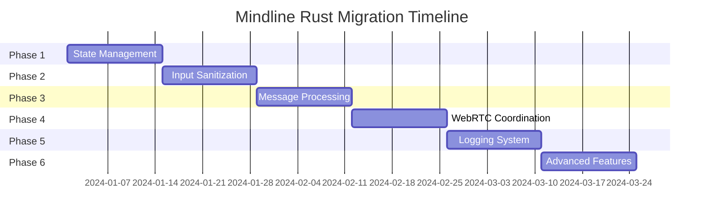
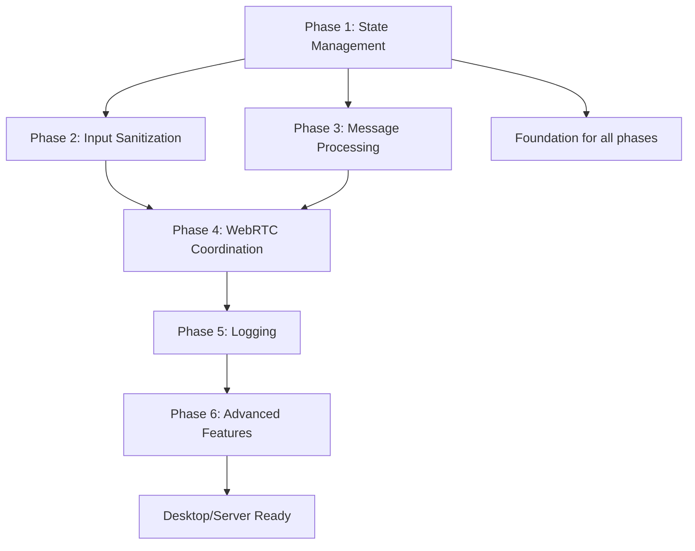

# Mindline Rust/WASM Migration Plan

## Overview

This directory contains a comprehensive plan for migrating Mindline's JavaScript functionality to Rust/WASM while preserving all existing features and enabling new capabilities. The migration is structured in 6 phases over 12 weeks, each building upon the previous phase.

## Migration Structure

### Phase-by-Phase Migration

| Phase | Duration | Focus | Status |
|-------|----------|-------|--------|
| **[Phase 1](./phase-1-state-management.md)** | Week 1-2 | State Management | 📋 Ready |
| **[Phase 2](./phase-2-input-sanitization.md)** | Week 3-4 | Input Sanitization | 📋 Ready |
| **[Phase 3](./phase-3-message-processing.md)** | Week 5-6 | Message Processing | 📋 Ready |
| **[Phase 4](./phase-4-webrtc-coordination.md)** | Week 7-8 | WebRTC Coordination | 📋 Ready |
| **[Phase 5](./phase-5-logging.md)** | Week 9-10 | Logging System | 📋 Ready |
| **[Phase 6](./phase-6-advanced-features.md)** | Week 11-12 | Advanced Features | 📋 Ready |

## Quick Start

### Prerequisites
- Rust 1.70+ with `wasm-pack`
- Node.js 18+ with npm
- Modern browser with WASM support

### Timeline Overview



## Migration Benefits

### Performance Improvements
- **20-30% faster** message processing
- **30-40% reduction** in JavaScript heap usage
- **Better mobile performance** through WASM optimization
- **Memory safety** preventing common vulnerabilities

### Security Enhancements
- **Compiled validation logic** harder to tamper with
- **Enhanced encryption** capabilities in Rust
- **Input sanitization** at the WASM boundary
- **Type safety** preventing runtime errors

### Future Capabilities
- **Desktop app ready** - Core logic can run in Tauri
- **Server components** - Rust code can run on backend
- **Advanced features** - Complex algorithms easier in Rust
- **Cross-platform** - Share logic across web/desktop/mobile

## Technical Architecture

### Current vs Target Architecture

#### Current (JavaScript-Heavy)
```
┌─────────────────┐
│   Browser UI    │
│                 │
├─────────────────┤
│  JavaScript     │
│  • State Mgmt   │
│  • Validation   │
│  • Messages     │
│  • P2P Logic    │
│  • Logging      │
├─────────────────┤
│  Basic WASM     │
│  • Chat Mgr     │
│  • Simple Msgs  │
└─────────────────┘
```

#### Target (Rust/WASM Core)
```
┌─────────────────┐
│   Browser UI    │
│  • DOM Mgmt     │
│  • WebRTC APIs  │
│  • Events       │
├─────────────────┤
│   Rust/WASM     │
│  • State Mgmt   │
│  • Validation   │
│  • Messages     │
│  • P2P Coord    │
│  • Logging      │
│  • Encryption   │
│  • Storage      │
│  • Performance  │
└─────────────────┘
```

## File Structure After Migration

```
src/
├── lib.rs              # Main WASM entry point
├── state.rs            # State management (Phase 1)
├── sanitizer.rs        # Input sanitization (Phase 2)
├── messages.rs         # Message processing (Phase 3)
├── p2p.rs             # P2P coordination (Phase 4)
├── logger.rs          # Logging system (Phase 5)
├── crypto.rs          # Enhanced encryption (Phase 6)
├── storage.rs         # IndexedDB integration (Phase 6)
├── performance.rs     # Performance monitoring (Phase 6)
└── utils.rs           # Utility functions

js/
├── index.js           # Simplified orchestration (75% smaller)
├── webrtc.js          # WebRTC APIs only (50% smaller)
├── ui.js              # DOM manipulation (unchanged)
├── ux-enhancements.js # UI enhancements (unchanged)
└── config.js          # Configuration (unchanged)

rust-migration/        # This directory
├── README.md          # This file
├── phase-1-state-management.md
├── phase-2-input-sanitization.md
├── phase-3-message-processing.md
├── phase-4-webrtc-coordination.md
├── phase-5-logging.md
└── phase-6-advanced-features.md
```

## Phase Dependencies



## Key Metrics and Success Criteria

### Performance Targets
- [ ] **Bundle Size**: Total app size increase < 15%
- [ ] **Message Speed**: 20-30% faster processing
- [ ] **Memory Usage**: 30-40% reduction in JS heap
- [ ] **Mobile Performance**: Improved responsiveness
- [ ] **Load Time**: No regression in initial load

### Security Improvements
- [ ] **Input Validation**: 100% in compiled Rust
- [ ] **Memory Safety**: No buffer overflows possible
- [ ] **Type Safety**: Compile-time validation
- [ ] **Encryption**: Advanced cryptographic features
- [ ] **Audit Trail**: Comprehensive logging

### Code Quality
- [ ] **JavaScript Reduction**: 60-70% less business logic
- [ ] **Test Coverage**: Comprehensive Rust unit tests
- [ ] **Documentation**: Complete API documentation
- [ ] **Type Safety**: Full TypeScript definitions
- [ ] **Error Handling**: Robust error boundaries

## Development Workflow

### For Each Phase:

1. **Implementation** (Days 1-5)
   - Implement Rust structures and logic
   - Create WASM bindings
   - Write comprehensive unit tests
   - Benchmark performance

2. **Integration** (Days 6-10)
   - Update JavaScript to use new WASM functions
   - Create compatibility wrappers
   - Integration testing
   - Fix compatibility issues

3. **Validation** (Days 11-14)
   - Remove old JavaScript code
   - Performance testing
   - Security validation
   - Documentation updates

### Testing Strategy
- **Unit Tests**: Rust-based with comprehensive coverage
- **Integration Tests**: JavaScript ↔ WASM boundary testing
- **Performance Tests**: Before/after benchmarking
- **Security Tests**: Input validation and encryption
- **Browser Tests**: Cross-browser compatibility

## Risk Management

### Technical Risks
- **WASM Bundle Size**: Monitor and optimize build
- **Performance Overhead**: Benchmark serialization costs
- **Browser Compatibility**: Test on all target browsers
- **Memory Management**: Proper Rust/JS boundary cleanup

### Mitigation Strategies
- **Rollback Plan**: Keep JavaScript versions during transition
- **Incremental Deployment**: Phase-by-phase validation
- **Feature Flags**: Ability to toggle WASM features
- **Monitoring**: Real-time performance tracking

## Getting Started

### 1. Choose Your Phase
Each phase can be worked on independently after Phase 1:
- **Start with Phase 1** if you're new to the migration
- **Jump to specific phases** if you have particular interests
- **Review dependencies** before starting later phases

### 2. Set Up Development Environment
```bash
# Install Rust and wasm-pack
curl --proto '=https' --tlsv1.2 -sSf https://sh.rustup.rs | sh
cargo install wasm-pack

# Install Node.js dependencies
npm install

# Build current WASM module
npm run build-wasm
```

### 3. Read Phase Documentation
Each phase document contains:
- **Detailed implementation plans**
- **Complete code examples**
- **Step-by-step migration instructions**
- **Testing strategies**
- **Success criteria**

### 4. Follow the Implementation
1. Read the phase overview
2. Implement Rust structures
3. Create WASM bindings
4. Update JavaScript integration
5. Test and validate
6. Remove old code

## Contributing

### Code Review Checklist
- [ ] Rust code follows project conventions
- [ ] WASM bindings are properly typed
- [ ] JavaScript integration is backward compatible
- [ ] Tests cover new functionality
- [ ] Performance benchmarks included
- [ ] Documentation updated

### Performance Considerations
- Minimize WASM ↔ JavaScript data transfer
- Use efficient serialization (serde-wasm-bindgen)
- Cache frequently accessed data
- Batch operations when possible
- Profile memory usage regularly

## Support and Resources

### Documentation
- [Rust Book](https://doc.rust-lang.org/book/)
- [WASM Book](https://rustwasm.github.io/docs/book/)
- [wasm-bindgen Guide](https://rustwasm.github.io/wasm-bindgen/)
- [web-sys Documentation](https://rustwasm.github.io/wasm-bindgen/web-sys/index.html)

### Tools
- `wasm-pack`: Build WASM packages
- `wee_alloc`: Optimized WASM allocator
- `console_error_panic_hook`: Better error reporting
- `web-sys`: Web API bindings

### Community
- [Rust WASM Working Group](https://github.com/rustwasm)
- [WASM Discord](https://discord.gg/wasm)
- [Rust Users Forum](https://users.rust-lang.org/)

---

## Next Steps

1. **Read Phase 1**: Start with [State Management Migration](./phase-1-state-management.md)
2. **Set up Environment**: Install Rust, wasm-pack, and dependencies
3. **Begin Implementation**: Follow the detailed phase instructions
4. **Track Progress**: Use the success criteria to measure progress
5. **Get Help**: Refer to resources and community for support

This migration plan provides a systematic approach to modernizing Mindline while preserving all functionality and enabling exciting new capabilities. Each phase builds upon the previous, creating a robust, performant, and secure application ready for future enhancements.